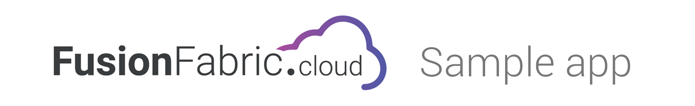
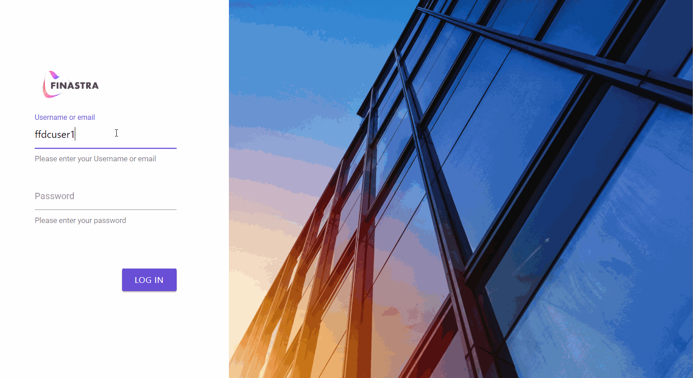
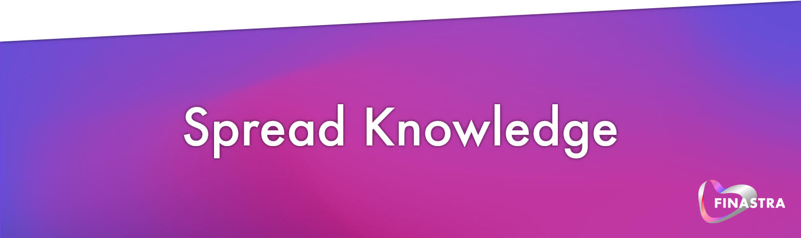

# 

> ### Sample _Corporate Banking application_ using [Finastra's Design System](https://github.com/fusionfabric/finastra-design-system) for the front-end and [FusionFabric.cloud](https://developer.fusionfabric.cloud) for backend.

<p align="center">
  <a href="./LICENSE.md"></a>
  
  <a href="https://twitter.com/FinastraFS"></a>
</p>

<p align="center">
  <a href="https://bit.ly/3dNw4Ss" target="_blank">
    
  </a>
  <!-- <a href="https://portal.azure.com/#create/Microsoft.Template/uri/https%3A%2F%2Fraw.githubusercontent.com%2Ffusionfabric%2Fffdc-sample-corporate-webapp%2Fmaster%2Fazuredeploy.json" target="_blank">
    
  </a> -->
</p>

<br/>

## Demo

<p align="center">
  
</p>

<br/>

## Installation

1. [Register an application on FFDC](https://medium.com/finastra-fintechs-devs/create-an-application-on-finastras-developer-portal-d90ef266cafb)

You need to register an application on [FusionFabric.cloud Developer Portal](https://developer.fusionfabric.cloud) and select [Account and Balances - B2C](https://developer.fusionfabric.cloud/api/corporate-accounteinfo-me-v1-831cb09d-cc10-4772-8ed5-8a6b72ec8e01/docs) API .

1. Setup environment variables

Rename `.env.template` to `.env` and setup `OIDC_CLIENT_ID` , `OIDC_CLIENT_SECRET` from the application created at step 1.

1. Run `npm i`

<br/>

## Build

This application contains two applications :

- Angular Application
- NestJs application

So you need to run two commands :

```
npm run dev           # client build in watch mode
npm run start:server  # server build in watch mode
```

Go to http://localhost:3000 and enjoy your demo application 😊

> To build for production, use `npm run build:prod`, which will build both the client and server !

<br/>

## Credentials

For testing purpose, you can login with one of the following credentials:

| User        | Password |
| :---------- | :------- |
| `ffdcuser1` | `123456` |
| `ffdcuser2` | `123456` |

<br/>

## Environement variables

| Variable                 | Default value                                                |
| :----------------------- | :----------------------------------------------------------- |
| `OIDC_CLIENT_ID`         |                                                              |
| `OIDC_CLIENT_SECRET`          |                                                              |                                                          |
| `SESSION_SECRET`         | Generated uiid                                               |
| `FFDC`                   | `https://api.fusionfabric.cloud`                             |
| `PORT`                   | `3000`                                                       |
| `OIDC_ISSUER`            | `https://api.fusionfabric.cloud/login/v1/sandbox`            |
| `OIDC_TOKEN_URL`         | `https://api.fusionfabric.cloud/login/v1/sandbox/oidc/token` |
| `OIDC_SCOPES`            | `openid profile`                                             |
| `OIDC_ORIGIN`            | `http://localhost:3000`                                      |

<br/>

## License

These sample applications are released under the MIT License. See [LICENSE](./LICENSE) for details.

<br />

[](https://www.finastra.com/)
